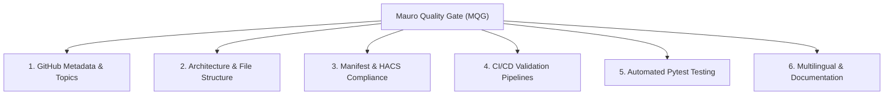

# Mauro Quality Gate (MQG) 🛡️

The unified engineering standard and automated quality gate for all Home Assistant custom integrations authored and maintained by **Mauro Druwel** ([@MauroDruwel](https://github.com/MauroDruwel)).

This repository defines the canonical standards, templates, CI/CD workflows, and automated compliance auditing tool so that every integration follows the exact same structure, quality standards, and user experience.

---

## The 6 Pillars of the Mauro Quality Gate



---

### 1. GitHub Metadata & Repository Topics

To keep repository tags clean and purposeful without tag overloading, every Home Assistant integration repository owned by `@MauroDruwel` uses strictly controlled topics:

| Topic | When to Apply | Purpose |
|---|---|---|
| `home-assistant-integration` | **Mandatory** on all custom component integrations | Identifies repository as an integration component |
| `hacs` | **Only** when available in official `hacs/default` | Signifies inclusion in the default HACS store |

> **Note:** Do not overload repositories with redundant tags (e.g. language, generic categories, or duplicate integration names). Keep topics strictly limited to `home-assistant-integration` (and `hacs` when in default store).

---

### 2. Component Architecture & File Structure

Every integration must adhere to the standard custom component filesystem layout:

```text
<repository-root>/
├── custom_components/<domain>/
│   ├── __init__.py           # Setup, unload, coordinator registration
│   ├── config_flow.py        # ConfigFlow + OptionsFlow UI
│   ├── const.py              # Constants, domain, defaults
│   ├── coordinator.py        # DataUpdateCoordinator with exponential retry
│   ├── manifest.json         # Integration manifest
│   ├── strings.json          # Translation source strings
│   ├── translations/
│   │   ├── en.json           # English UI strings
│   │   └── nl.json           # Dutch UI strings (native support)
│   ├── sensor.py             # Sensor platform (and/or binary_sensor, switch...)
│   └── py.typed              # PEP 561 typing marker
├── .github/
│   └── workflows/
│       ├── validate.yml      # Hassfest & HACS action validation
│       └── tests.yml         # Pytest test suite runner
├── tests/
│   ├── __init__.py
│   ├── conftest.py           # auto_enable_custom_integrations + mocks
│   ├── test_config_flow.py   # Full coverage of setup & options flow
│   └── test_init.py          # Setup, refresh, unload & failure tests
├── hacs.json                 # HACS configuration
├── pytest.ini                # Pytest configuration
├── LICENSE                   # MIT License
└── README.md                 # Standard documentation with status badges
```

---

### 3. Manifest & HACS Compliance

#### `manifest.json` Rules
- `"codeowners"`: Must include `["@MauroDruwel"]`.
- `"integration_type"`: Must be `"device"`, `"hub"`, or `"service"`.
- `"iot_class"`: Must be `"cloud_polling"`, `"cloud_push"`, `"local_polling"`, or `"local_push"`.
- `"version"`: SemVer string (e.g. `1.1.0`), matching Git releases.
- `"config_flow"`: Must be `true` (no YAML-only configuration).
- `"issue_tracker"`: Link to the repository's GitHub issues page.
- `"requirements"`: Pinned or bounded upstream libraries (e.g. `weathercloud>=0.1.5`).

#### `hacs.json` Rules
- Must be in repository root:
```json
{
  "name": "Integration Name",
  "render_readme": true
}
```

---

### 4. CI/CD Validation Pipelines

Every integration repository must include automated GitHub Actions:

1. **`validate.yml`**:
   - Runs on: `push` to `main`, `pull_request`, and weekly schedule (`cron: "0 4 * * 1"`).
   - **Hassfest**: `home-assistant/actions/hassfest@master` verifies manifest, translations, and component schema.
   - **HACS Validation**: `hacs/action@main` verifies compliance with HACS repository rules.

2. **`tests.yml`**:
   - Runs `pytest` with `pytest-homeassistant-custom-component`.
   - Generates code coverage metrics.

---

### 5. Automated Testing Standards

Every integration must maintain high test coverage using `pytest-homeassistant-custom-component`:
- **Config Flow Tests** (`test_config_flow.py`):
  - User setup step success.
  - Invalid credentials error handling.
  - Duplicate instance prevention (unique ID collision).
  - OptionsFlow testing (e.g. configurable poll intervals).
- **Lifecycle Tests** (`test_init.py`):
  - Successful entry setup and sensor creation.
  - Dynamic options updates without restarting Home Assistant.
  - Graceful unload releasing API connections/sessions.
  - API failures triggering `ConfigEntryNotReady` retries.
- **Entity State & Attributes**:
  - Extra state attributes verified (e.g. `ATTR_LATITUDE`, `ATTR_LONGITUDE` for map cards).

---

### 6. Multilingual & Documentation Standards

- **Translations**: Always provide `en.json` and `nl.json` in `translations/`.
- **README.md**:
  - Mandatory badges: HACS, Release, Hassfest, Tests, License.
  - Features list with emojis.
  - Installation via HACS (Step-by-step) and Manual.
  - Configuration instructions with screenshots where possible.
  - Debug logging snippet for `configuration.yaml`.

---

## Automated Quality Gate Audit Tool

This repository includes an automated CLI script to audit any local or remote repository against all Mauro Quality Gate rules:

```bash
# Audit a local integration directory
python scripts/audit_integration.py /path/to/Weathercloud-HA

# Audit a remote repository on GitHub
python scripts/audit_integration.py MauroDruwel/SMA-ennexOS-cloud-HA --remote

# Audit all of Mauro's known Home Assistant integration repos
python scripts/audit_integration.py --all-remote
```

### Sample Audit Output

```text
=======================================================
  MAURO QUALITY GATE AUDIT: MauroDruwel/Weathercloud-HA
=======================================================

[GITHUB TOPICS]
  ✅ PASS   home-assistant-integration tag   Topics: ['hacs', 'home-assistant', 'home-assistant-integration']
  ✅ PASS   home-assistant tag               Topics: ['hacs', 'home-assistant', 'home-assistant-integration']
  ✅ PASS   hacs tag                         Topics: ['hacs', 'home-assistant', 'home-assistant-integration']

[STRUCTURE]
  ✅ PASS   custom_components directory      Exists: True
  ✅ PASS   Single domain component          Found: ['weathercloud']

[HACS]
  ✅ PASS   hacs.json present                Exists: True
  ✅ PASS   hacs.json valid JSON & has name  name: Weathercloud
  ✅ PASS   hacs.json render_readme set      render_readme: True

[MANIFEST]
  ✅ PASS   manifest.json exists             Path: custom_components/weathercloud/manifest.json
  ✅ PASS   codeowners has @MauroDruwel      codeowners: ['@MauroDruwel']
  ✅ PASS   version matches semver           version: 1.1.0
  ✅ PASS   config_flow is true              config_flow: True

[WORKFLOWS]
  ✅ PASS   Hassfest action workflow         Uses home-assistant/actions/hassfest
  ✅ PASS   HACS action validation workflow  Uses hacs/action
  ✅ PASS   pytest testing workflow          Runs pytest in CI

[TESTS]
  ✅ PASS   tests directory exists           Exists: True
  ✅ PASS   Test files present               Found: ['test_config_flow.py', 'test_init.py']
  ✅ PASS   conftest.py exists               Exists: True

-------------------------------------------------------
  Result: PASSED QUALITY GATE (Score: 100.0%)
=======================================================
```

---

## Template Files

The `templates/` folder contains drop-in starter files for new or refactored integrations:
- `templates/workflows/validate.yml` — Hassfest & HACS action validation workflow
- `templates/workflows/tests.yml` — Pytest GitHub Actions workflow
- `templates/docs/README.md` — Canonical README template
- `templates/docs/hacs.json` — Standard HACS metadata
- `templates/tests/conftest.py` — Test fixture boilerplate
- `templates/tests/pytest.ini` — Pytest configuration

---

## License

MIT © [Mauro Druwel](https://maurodruwel.be)
